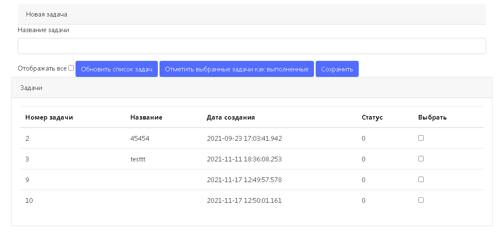

# job4j_todo
Приложение "TODO список".
Если дело сделано, то его отмечают, как выполненное и оно исчезает из списка.

- В качестве СУБД используется Postgres версии 12.
- Все данные на форму загружаться через ajax.
- Форма позволяет добавить новое задание и отобразить список всех заданий с фильтрацией по признаку выполнено или нет.
- Данные сохраняются через hibernate.
- Для вида использован bootstrap.

task_124176

